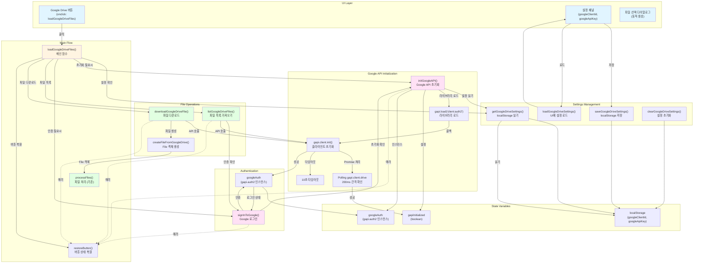
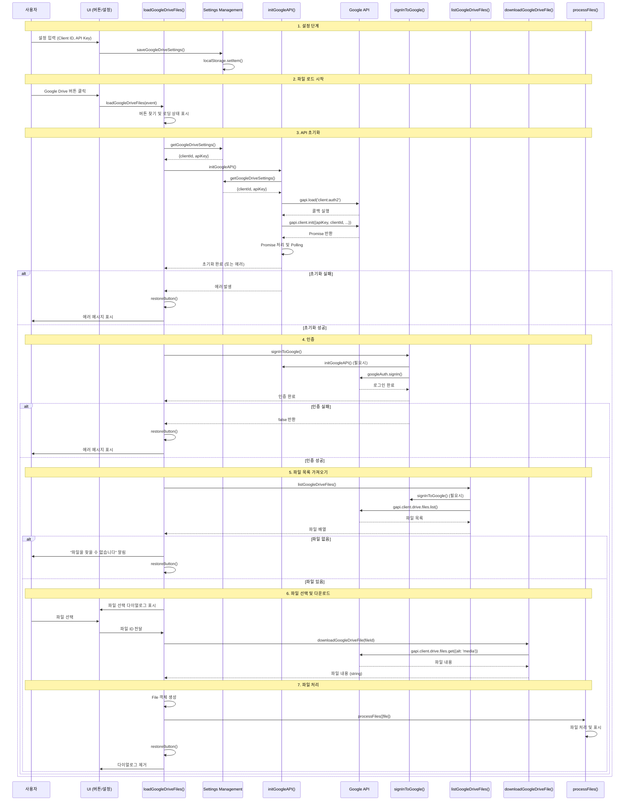
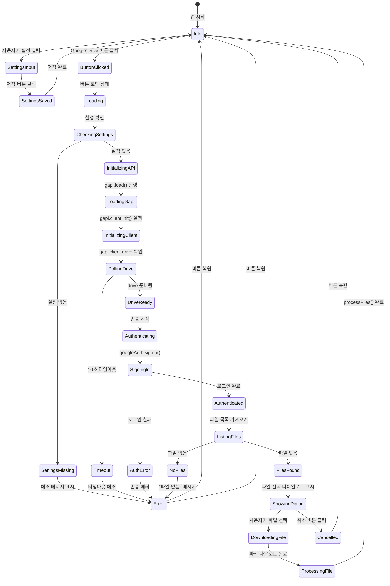
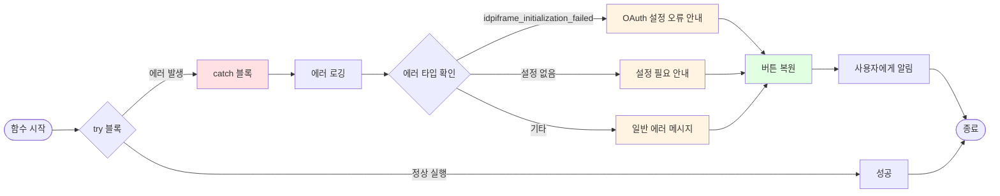

# Google Drive 통합 아키텍처 다이어그램

## 컴포넌트 관계도

```mermaid
graph TB
    subgraph "UI Layer"
        UI_Button["Google Drive 버튼<br/>(onclick: loadGoogleDriveFiles)"]
        UI_Settings["설정 패널<br/>(googleClientId, googleApiKey)"]
        UI_Dialog["파일 선택 다이얼로그<br/>(동적 생성)"]
    end

    subgraph "Settings Management"
        GetSettings["getGoogleDriveSettings()<br/>localStorage 읽기"]
        SaveSettings["saveGoogleDriveSettings()<br/>localStorage 저장"]
        LoadSettings["loadGoogleDriveSettings()<br/>UI에 설정 로드"]
        ClearSettings["clearGoogleDriveSettings()<br/>설정 초기화"]
    end

    subgraph "Google API Initialization"
        InitAPI["initGoogleAPI()<br/>Google API 초기화"]
        GapiLoad["gapi.load('client:auth2')<br/>라이브러리 로드"]
        GapiInit["gapi.client.init()<br/>클라이언트 초기화"]
        PollDrive["Polling gapi.client.drive<br/>200ms 간격 확인"]
        Timeout["10초 타임아웃"]
    end

    subgraph "Authentication"
        SignIn["signInToGoogle()<br/>Google 로그인"]
        GoogleAuth["googleAuth<br/>(gapi.auth2 인스턴스)"]
    end

    subgraph "File Operations"
        ListFiles["listGoogleDriveFiles()<br/>파일 목록 가져오기"]
        DownloadFile["downloadGoogleDriveFile()<br/>파일 다운로드"]
        CreateFile["createFileFromGoogleDrive()<br/>File 객체 생성"]
    end

    subgraph "Main Flow"
        LoadFiles["loadGoogleDriveFiles()<br/>메인 함수"]
        ProcessFiles["processFiles()<br/>파일 처리 (기존)"]
        RestoreButton["restoreButton()<br/>버튼 상태 복원"]
    end

    subgraph "State Variables"
        GapiInitFlag["gapiInitialized<br/>(boolean)"]
        AuthInstance["googleAuth<br/>(gapi.auth2 인스턴스)"]
        LocalStorage["localStorage<br/>(googleClientId, googleApiKey)"]
    end

    %% UI to Main Flow
    UI_Button -->|클릭| LoadFiles
    UI_Settings -->|저장| SaveSettings
    UI_Settings -->|로드| LoadSettings

    %% Settings Management
    SaveSettings --> LocalStorage
    GetSettings --> LocalStorage
    LoadSettings --> UI_Settings
    ClearSettings --> LocalStorage

    %% Main Flow to Initialization
    LoadFiles -->|설정 확인| GetSettings
    LoadFiles -->|초기화 필요시| InitAPI
    LoadFiles -->|인증 필요시| SignIn
    LoadFiles -->|파일 목록| ListFiles
    LoadFiles -->|파일 다운로드| DownloadFile
    LoadFiles -->|버튼 복원| RestoreButton

    %% Initialization Flow
    InitAPI -->|설정 읽기| GetSettings
    InitAPI -->|라이브러리 로드| GapiLoad
    GapiLoad -->|콜백| GapiInit
    GapiInit -->|Promise 처리| PollDrive
    GapiInit -->|타임아웃| Timeout
    PollDrive -->|성공| GapiInitFlag
    GapiInit -->|성공| GoogleAuth
    GoogleAuth --> AuthInstance

    %% Authentication Flow
    SignIn -->|초기화 확인| InitAPI
    SignIn -->|인증| GoogleAuth
    GoogleAuth -->|로그인 상태| SignIn

    %% File Operations Flow
    ListFiles -->|인증 확인| SignIn
    ListFiles -->|API 호출| GapiInit
    DownloadFile -->|API 호출| GapiInit
    DownloadFile -->|파일 생성| CreateFile
    CreateFile -->|File 객체| ProcessFiles

    %% State Management
    InitAPI -->|설정| GapiInitFlag
    InitAPI -->|인스턴스| AuthInstance
    GetSettings -->|읽기| LocalStorage

    %% Error Handling
    InitAPI -.->|에러| RestoreButton
    SignIn -.->|에러| RestoreButton
    ListFiles -.->|에러| RestoreButton
    DownloadFile -.->|에러| RestoreButton

    style UI_Button fill:#e1f5ff
    style UI_Settings fill:#e1f5ff
    style UI_Dialog fill:#e1f5ff
    style LoadFiles fill:#fff4e1
    style InitAPI fill:#ffe1f5
    style SignIn fill:#ffe1f5
    style ListFiles fill:#e1ffe1
    style DownloadFile fill:#e1ffe1
    style ProcessFiles fill:#e1ffe1
```

## 데이터 흐름도

```mermaid
sequenceDiagram
    participant User as 사용자
    participant UI as UI (버튼/설정)
    participant Main as loadGoogleDriveFiles()
    participant Settings as Settings Management
    participant Init as initGoogleAPI()
    participant Gapi as Google API
    participant Auth as signInToGoogle()
    participant List as listGoogleDriveFiles()
    participant Download as downloadGoogleDriveFile()
    participant Process as processFiles()

    Note over User,Process: 1. 설정 단계
    User->>UI: 설정 입력 (Client ID, API Key)
    UI->>Settings: saveGoogleDriveSettings()
    Settings->>Settings: localStorage.setItem()
    
    Note over User,Process: 2. 파일 로드 시작
    User->>UI: Google Drive 버튼 클릭
    UI->>Main: loadGoogleDriveFiles(event)
    Main->>Main: 버튼 찾기 및 로딩 상태 표시
    
    Note over User,Process: 3. API 초기화
    Main->>Settings: getGoogleDriveSettings()
    Settings-->>Main: {clientId, apiKey}
    Main->>Init: initGoogleAPI()
    Init->>Settings: getGoogleDriveSettings()
    Settings-->>Init: {clientId, apiKey}
    Init->>Gapi: gapi.load('client:auth2')
    Gapi-->>Init: 콜백 실행
    Init->>Gapi: gapi.client.init({apiKey, clientId, ...})
    Gapi-->>Init: Promise 반환
    Init->>Init: Promise 처리 및 Polling
    Init-->>Main: 초기화 완료 (또는 에러)
    
    alt 초기화 실패
        Init-->>Main: 에러 발생
        Main->>Main: restoreButton()
        Main->>User: 에러 메시지 표시
    else 초기화 성공
        Note over User,Process: 4. 인증
        Main->>Auth: signInToGoogle()
        Auth->>Init: initGoogleAPI() (필요시)
        Auth->>Gapi: googleAuth.signIn()
        Gapi-->>Auth: 로그인 완료
        Auth-->>Main: 인증 완료
        
        alt 인증 실패
            Auth-->>Main: false 반환
            Main->>Main: restoreButton()
            Main->>User: 에러 메시지 표시
        else 인증 성공
            Note over User,Process: 5. 파일 목록 가져오기
            Main->>List: listGoogleDriveFiles()
            List->>Auth: signInToGoogle() (필요시)
            List->>Gapi: gapi.client.drive.files.list()
            Gapi-->>List: 파일 목록
            List-->>Main: 파일 배열
            
            alt 파일 없음
                Main->>User: "파일을 찾을 수 없습니다" 알림
                Main->>Main: restoreButton()
            else 파일 있음
                Note over User,Process: 6. 파일 선택 및 다운로드
                Main->>UI: 파일 선택 다이얼로그 표시
                User->>UI: 파일 선택
                UI->>Main: 파일 ID 전달
                Main->>Download: downloadGoogleDriveFile(fileId)
                Download->>Gapi: gapi.client.drive.files.get({alt: 'media'})
                Gapi-->>Download: 파일 내용
                Download-->>Main: 파일 내용 (string)
                
                Note over User,Process: 7. 파일 처리
                Main->>Main: File 객체 생성
                Main->>Process: processFiles([file])
                Process->>Process: 파일 처리 및 표시
                Main->>Main: restoreButton()
                Main->>UI: 다이얼로그 제거
            end
        end
    end
```

## 상태 관리 다이어그램

```mermaid
stateDiagram-v2
    [*] --> Idle: 앱 시작
    
    Idle --> SettingsInput: 사용자가 설정 입력
    SettingsInput --> SettingsSaved: 저장 버튼 클릭
    SettingsSaved --> Idle: 저장 완료
    
    Idle --> ButtonClicked: Google Drive 버튼 클릭
    ButtonClicked --> Loading: 버튼 로딩 상태
    
    Loading --> CheckingSettings: 설정 확인
    CheckingSettings --> SettingsMissing: 설정 없음
    CheckingSettings --> InitializingAPI: 설정 있음
    
    SettingsMissing --> Error: 에러 메시지 표시
    Error --> Idle: 버튼 복원
    
    InitializingAPI --> LoadingGapi: gapi.load() 실행
    LoadingGapi --> InitializingClient: gapi.client.init() 실행
    InitializingClient --> PollingDrive: gapi.client.drive 확인
    PollingDrive --> DriveReady: drive 준비됨
    PollingDrive --> Timeout: 10초 타임아웃
    
    Timeout --> Error: 타임아웃 에러
    DriveReady --> Authenticating: 인증 시작
    
    Authenticating --> SigningIn: googleAuth.signIn()
    SigningIn --> Authenticated: 로그인 완료
    SigningIn --> AuthError: 로그인 실패
    
    AuthError --> Error: 인증 에러
    Authenticated --> ListingFiles: 파일 목록 가져오기
    
    ListingFiles --> FilesFound: 파일 있음
    ListingFiles --> NoFiles: 파일 없음
    
    NoFiles --> Error: "파일 없음" 메시지
    FilesFound --> ShowingDialog: 파일 선택 다이얼로그 표시
    
    ShowingDialog --> DownloadingFile: 사용자가 파일 선택
    ShowingDialog --> Cancelled: 취소 버튼 클릭
    
    Cancelled --> Idle: 버튼 복원
    DownloadingFile --> ProcessingFile: 파일 다운로드 완료
    
    ProcessingFile --> Idle: processFiles() 완료
    
    Error --> Idle: 버튼 복원
```

## 에러 처리 흐름

```mermaid
graph LR
    Start([함수 시작]) --> Try{try 블록}
    Try -->|정상 실행| Success[성공]
    Try -->|에러 발생| Catch[catch 블록]
    
    Catch --> LogError[에러 로깅]
    LogError --> CheckErrorType{에러 타입 확인}
    
    CheckErrorType -->|idpiframe_initialization_failed| ShowOAuthError[OAuth 설정 오류 안내]
    CheckErrorType -->|설정 없음| ShowSettingsError[설정 필요 안내]
    CheckErrorType -->|기타| ShowGenericError[일반 에러 메시지]
    
    ShowOAuthError --> RestoreButton[버튼 복원]
    ShowSettingsError --> RestoreButton
    ShowGenericError --> RestoreButton
    
    RestoreButton --> Alert[사용자에게 알림]
    Alert --> End([종료])
    
    Success --> End
    
    style Catch fill:#ffe1e1
    style ShowOAuthError fill:#fff4e1
    style ShowSettingsError fill:#fff4e1
    style ShowGenericError fill:#fff4e1
    style RestoreButton fill:#e1ffe1
```

